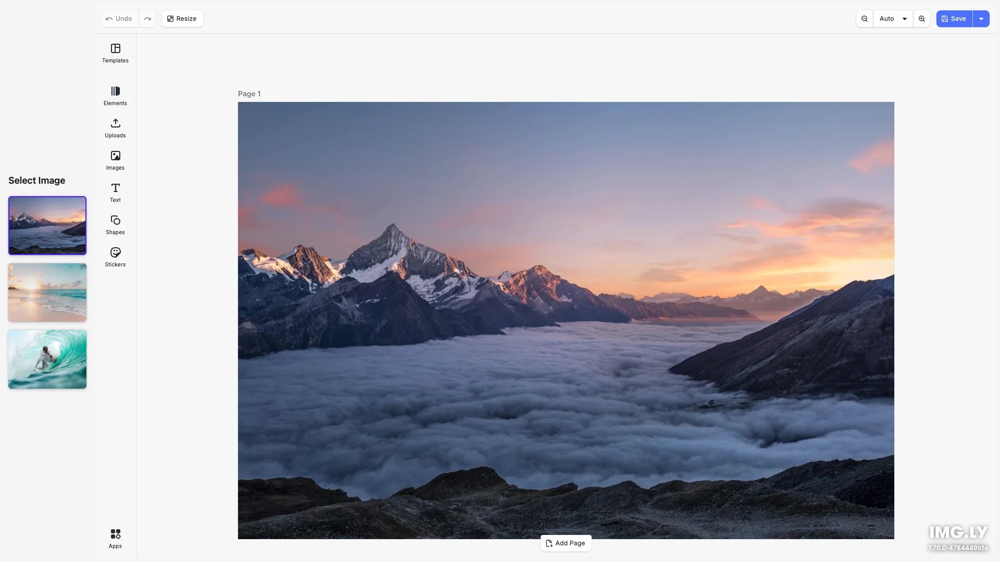

# Start With Image Editor Starter Kit

Open the design editor with an image as the starting point — perfect for photo editing workflows, social media editors, or image-based design tools. Built with [CE.SDK](https://img.ly/creative-sdk) by [IMG.LY](https://img.ly), runs entirely in the browser with no server dependencies.

<p>
  <a href="https://img.ly/docs/cesdk/starterkits/start-with-image/">Documentation</a> |
  <a href="https://img.ly/showcases/cesdk">Live Demo</a>
</p>



## Getting Started

### Clone the Repository

```bash
git clone https://github.com/imgly/starterkit-start-with-image-react-web.git
cd starterkit-start-with-image-react-web
```

### Install Dependencies

```bash
npm install
```

### Download Assets

CE.SDK requires engine assets (fonts, icons, UI elements) served from your `public/` directory.

```bash
curl -O https://cdn.img.ly/packages/imgly/cesdk-js/$UBQ_VERSION$/imgly-assets.zip
unzip imgly-assets.zip -d public/
rm imgly-assets.zip
```

### Run the Development Server

```bash
npm run dev
```

Open `http://localhost:5173` in your browser.

## Configuration

### Starting with an Image

The key feature of this starterkit is initializing the editor with an image:

```typescript
// Create a design from an image URL
await cesdk.createFromImage('https://example.com/image.jpg');

// Select the image for immediate editing
const blocks = cesdk.engine.block.findByKind('image');
if (blocks.length > 0) {
  cesdk.engine.block.setSelected(blocks[0], true);
}
```

This creates a new design scene with the image placed on the canvas, ready for editing.

### Loading Content

You can also load content using other methods:

```typescript
// Create a blank design canvas
await cesdk.createDesignScene();

// Load from a template archive
await cesdk.loadFromArchiveURL('https://example.com/template.zip');

// Load from a scene file
await cesdk.loadFromURL('https://example.com/scene.json');
```

See [Open the Editor](https://img.ly/docs/cesdk/web/guides/open-editor/) for all loading methods.

### Theming

```typescript
cesdk.ui.setTheme('dark'); // 'light' | 'dark' | 'system'
```

See [Theming](https://img.ly/docs/cesdk/web/ui-styling/theming/) for custom color schemes and styling.

### Localization

```typescript
cesdk.i18n.setTranslations({
  de: { 'common.save': 'Speichern' }
});
cesdk.i18n.setLocale('de');
```

See [Localization](https://img.ly/docs/cesdk/web/ui-styling/localization/) for supported languages and translation keys.

## Architecture

```
src/
├── app/                          # Demo application
├── imgly/
│   ├── config/
│   │   ├── actions.ts                # Export/import actions
│   │   ├── features.ts               # Feature toggles
│   │   ├── i18n.ts                   # Translations
│   │   ├── plugin.ts                 # Main configuration plugin
│   │   ├── settings.ts               # Engine settings
│   │   └── ui/
│   │       ├── canvas.ts                 # Canvas configuration
│   │       ├── components.ts             # Custom component registration
│   │       ├── dock.ts                   # Dock layout configuration
│   │       ├── index.ts                  # Combines UI customization exports
│   │       ├── inspectorBar.ts           # Inspector bar layout
│   │       ├── navigationBar.ts          # Navigation bar layout
│   │       └── panel.ts                  # Panel configuration
│   └── index.ts                  # Editor initialization function
└── index.tsx                 # Application entry point
```

## Image Selection Sidebar

This starterkit includes a sidebar for selecting from multiple images:

```typescript
// Sample images array
const SAMPLE_IMAGES = [
  { full: 'https://example.com/image1.jpg', thumb: 'https://example.com/thumb1.jpg', alt: 'Image 1' },
  { full: 'https://example.com/image2.jpg', thumb: 'https://example.com/thumb2.jpg', alt: 'Image 2' },
];

// When user clicks an image, reinitialize the editor
async function selectImage(index: number) {
  if (currentCesdk) currentCesdk.dispose();
  currentCesdk = await CreativeEditorSDK.create('#cesdk_container', config);
  await initStartWithImageEditor(currentCesdk, SAMPLE_IMAGES[index].full);
}
```

Customize the `SAMPLE_IMAGES` array in `src/index.ts` with your own images.

## Key Capabilities

- **Image Selection Sidebar** – Choose from multiple images before editing
- **Image-First Workflow** – Start editing immediately with the selected image
- **Photo Editing** – Crop, adjust, filter, and enhance images
- **Design Tools** – Add text, shapes, and overlays to images
- **Background Removal** – AI-powered background removal
- **Export** – PNG, JPEG, PDF with quality controls

## Prerequisites

- **Node.js v20+** with npm – [Download](https://nodejs.org/)
- **Supported browsers** – Chrome 114+, Edge 114+, Firefox 115+, Safari 15.6+

## Troubleshooting

| Issue | Solution |
|-------|----------|
| Editor doesn't load | Verify assets are accessible at `baseURL` |
| Assets don't appear | Check `public/assets/` directory exists |
| Watermark appears | Add your license key |
| Image doesn't load | Check image URL is accessible (CORS) |

## Documentation

For complete integration guides and API reference, visit the [Start With Image Documentation](https://img.ly/docs/cesdk/starterkits/start-with-image/).

## License

This project is licensed under the MIT License - see the [LICENSE](LICENSE) file for details.

---

<p align="center">Built with <a href="https://img.ly/creative-sdk?utm_source=github&utm_medium=project&utm_campaign=starterkit-start-with-image">CE.SDK</a> by <a href="https://img.ly?utm_source=github&utm_medium=project&utm_campaign=starterkit-start-with-image">IMG.LY</a></p>
